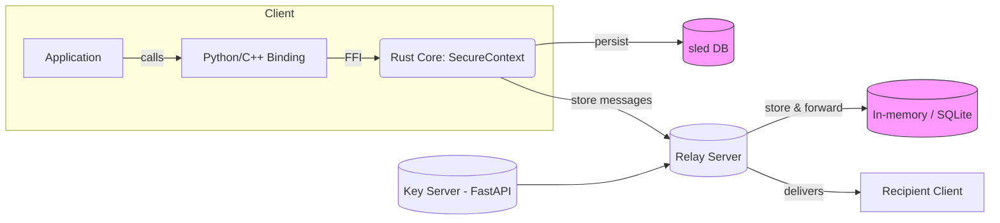
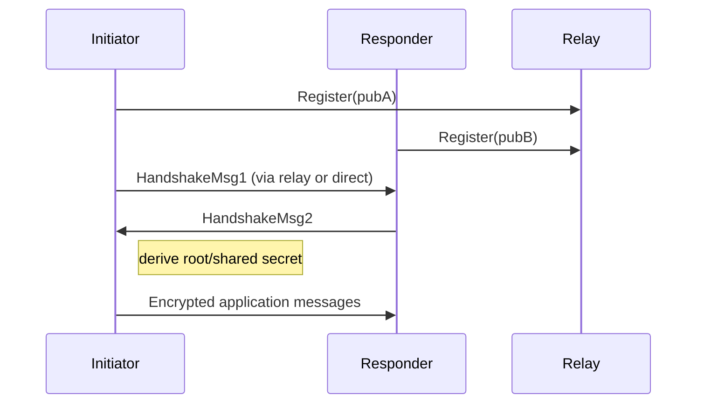

# sibnav4_pro — Secure Messaging Core & Relay

This repository contains a modular implementation of a secure, end-to-end
encrypted messaging protocol kernel (Rust), language bindings (Python, C++),
and a reference Relay / Key-Server implementation. The project focuses on
practical, well-audited primitives (X25519, ChaCha20-Poly1305, HKDF) and uses
Double Ratchet-style sessions for forward secrecy and post-compromise
recovery.

This README documents the protocol, the components in this repository,
build and usage instructions, security considerations, and testing.

Contents
- **Overview** — goals and constraints
- **Architecture** — components, data flows, and diagrams
- **Protocol primitives** — cryptography and message framing
- **Handshake & Double Ratchet** — how sessions are established and used
- **Relay & Key Server** — store-and-forward and pre-key server behavior
- **Bindings & APIs** — Python and C++ usage examples
- **Build & Install** — how to compile the native core and use bindings
- **Testing** — running unit/integration checks
- **Security Considerations** — threat model and recommendations
- **Contributing & License**

---

**Status:**** Proof-of-concept, production oriented design. The implementation
contains core components and reference servers; some parts are intentionally
minimal for demonstration (e.g., temporary in-memory stores) and are marked in
code for extension.

Overview
--------

sibnav4_pro implements an end-to-end encrypted messaging kernel with the
following high-level properties:

- End-to-end encryption: messages are encrypted between peers using session
	keys derived from a secure handshake and a Double Ratchet mechanism.
- Forward secrecy and post-compromise security: the design includes periodic
	key rotation, ratchet chains, and message skipping limits.
- Minimal attack surface: the relay/key-server only sees metadata (sender and
	recipient identifiers) and cannot decrypt message contents.
- Language bindings: the Rust core exposes an FFI layer so higher-level
	clients can use the same secure primitives from Python, C++, or other
	languages.

Repository layout (important files)
----------------------------------

- `core/` — Rust implementation of the secure protocol kernel
	- `core/src/crypto/` — ChaCha20-Poly1305 encryptor, KDFs, secure RNG
	- `core/src/ratchet/` — Double Ratchet session implementation
	- `core/src/handshake/` — Handshake builder for session setup
	- `core/src/ffi/` — C-compatible FFI layer exposing core features
	- `core/Cargo.toml` — crate settings (produces `cdylib` / shared lib)
- `bindings/python/` — Python wrapper using `ctypes` against the native lib
	- `bindings/python/secure_protocol/__init__.py` — high-level Python API
- `bindings/cpp/` — C++ wrapper that calls the generated C header
- `server/` — reference Key Server and Relay implementation (FastAPI)
	- `server/main.py` — Key upload/endpoints and security middleware
- `docs/relay_protocol.md` — Binary relay protocol description (TCP framing)
- `tests/` — basic integration/test harnesses

Architecture & Data Flow
------------------------

At a high level there are three logical layers:

1. Core (Rust): crypto primitives, handshake logic, session state and
	 persistence (sled DB). Exposed via FFI.
2. Bindings: Python and C++ wrappers that load the native library and
	 provide convenient objects (SecureContext, SecureSession).
3. Network & Relay: reference servers and sample clients that demonstrate the
	 network protocols (store-and-forward relay, HTTP key server).

Mermaid architecture diagram (works on GitHub with Mermaid enabled):



Relay Binary Protocol (TCP)
---------------------------

The reference relay implements a simple length-prefixed binary protocol
(documented in `docs/relay_protocol.md`). Commands are framed over TCP with
a 4-byte big-endian length prefix when blobs are transferred, and a 1-byte
command code when control commands are sent.

Basic commands:

- `REGISTER (0x01)` — client announces identity/public key (32 bytes)
- `SEND (0x02)` — send to a recipient: recipient pubkey (32) + length (4) + blob
- `FETCH (0x03)` — fetch pending messages; server responds with count and
	messages (sender pubkey, length, blob)

Note: The provided relay is a reference implementation. For scale and
production, replace the in-memory store with a durable queue (e.g. Redis,
Postgres) and add authentication & TLS at the transport layer.

Cryptographic Primitives
-------------------------

The core implements and composes the following primitives (see `core/src`):

- X25519 for Diffie–Hellman (key agreement)
- ChaCha20-Poly1305 for AEAD encryption of messages
- HKDF-based KDF for deriving symmetric keys between protocol steps
- Double Ratchet (ratchet chains) for symmetric-key ratcheting and
	message keys

Implementation notes:
- `core/src/crypto/encryptor.rs` provides ChaCha20Poly1305-based encrypt/decrypt
	helpers and bundles a 12-byte nonce with ciphertext.
- `core/src/ratchet/` implements stateful session handling (chains, skipped
	message buffers, serialization for persistence).

Handshake & Session Lifecycle
-----------------------------

The handshake builder constructs an ephemeral handshake to bootstrap a
Double Ratchet session. The key steps are:

1. Instantiate a `SecureContext` (keystore, RNG, session manager, sled DB).
2. Use `HandshakeBuilder` with optional prologue and peer public key.
3. Exchange handshake messages (the builder returns the bytes the caller
	 should send on the wire).
4. On successful handshake, both peers initialize a `DoubleRatchetSession`
	 with shared secrets derived from the handshake.

Session operations:

- `encrypt_message(session_id, plaintext, associated_data)` — produces
	ciphertext; state is persisted after sending.
- `decrypt_message(session_id, ciphertext, associated_data)` — consumes a
	ciphertext and advances ratchet state as needed.

Persistence
-----------

Session and keystore state are persisted using `sled` (embedded key-value
store) so sessions survive restarts. `SessionManager` caches sessions in
memory and falls back to loading serialized session state from sled.

Language Bindings & Examples
----------------------------

Python (reference binding) — `bindings/python/secure_protocol` exposes:
- `SecureContext` — create contexts and manage sessions
- `SecureSession` — encrypt/decrypt using the native session
- `generate_keypair()` — convenience helper

Example (Python):

```python
from secure_protocol import SecureContext, generate_keypair

# Build and ensure the native library is available (see Build section)
pub, priv = generate_keypair()
ctx = SecureContext()
session = ctx.create_session(b"peer-id-123")
# Use session.encrypt / decrypt via SecureSocket or direct session methods
```

C++ (reference header) — `bindings/cpp/include/secure_protocol.hpp` exposes
`SecureContext` and `SecureSession` thin wrappers around the C ABI.

Example (conceptual):

```cpp
auto ctx = secure::SecureContext::Create();
auto session = ctx->CreateSession(std::vector<uint8_t>{'p','e','e','r'});
auto ct = session->Encrypt(plaintext);
```

Building & Installing
---------------------

Prerequisites:
- Rust toolchain (stable) and `cargo`
- `cargo` workspace builds the core crate as a `cdylib` (shared library)
- Python 3.8+ for Python bindings and examples

Steps (recommended for local development):

1. Build the Rust core (release):

```powershell
cd core
cargo build --release
```

On Windows the build will produce a `dll` (e.g. `target\\release\\secure_protocol.dll`).
Place or copy that DLL into `bindings/python/` (or add it to `PATH`) so the
Python `ctypes` loader can find it.

2. Install Python bindings (optional):

```powershell
cd bindings\\python
pip install -e .
```

3. Run the reference Key Server / Relay (FastAPI):

```powershell
python server\\main.py
# or run with uvicorn for production-like server
uvicorn server.main:app --host 0.0.0.0 --port 8000
```

Notes:
- For cross-language deployments you may instead build a shared library and
	package it into a wheel / native distribution for each platform.
- `core/Cargo.toml` builds a `cdylib` which is what the Python `ctypes`
	wrapper expects. The crate feature `ffi` enables additional compatibility
	helpers.

Testing
-------

There are a few integration tests in `tests/`. The Python tests try to import
the native bindings and will skip tests if the shared library is not
available. To run tests:

```powershell
python -m unittest tests.integration_test
```

Security Considerations
-----------------------

This README aims to be honest about limitations and assumptions in the
reference implementation:

- The Relay / Key Server in `server/` does not decrypt client messages, but it
	sees metadata (who is talking to whom). Avoid using a single relay for
	highly private deployments unless you trust the operator or use mix/anonymity
	layers.
- The Python example code in `bindings/python` uses `ctypes` to call into
	native code. Loading native code has platform-specific requirements (DLLs,
	`PATH` on Windows) and must be done carefully.
- The provided FastAPI Key Server stores one-time pre-keys and pre-key
	bundles; ensure database backups and access control are implemented for
	production. Use TLS (HTTPS) in front of the FastAPI server and enforce
	authentication for management endpoints.
- Rate limiting and payload size checks are demonstrated in `server/main.py`.
	These are minimal and should be replaced with hardened, distributed rate
	limiting (e.g. Redis) in production.
- Always keep cryptographic dependencies up-to-date and consider formal
	verification or third-party audit for production use.

Interactive Diagrams & Exporting
-------------------------------

This README includes Mermaid diagrams (above). For production documentation
you may want to export static images (SVG/PNG) for README landing pages. Use
the `mermaid-cli` or GitHub's rendering.

Example Mermaid snippet (Handshake flow):



Contributing
------------

Contributions are welcome. For substantive changes:

- Open an issue describing the proposed change or bug.
- For code contributions, open a pull request with focused commits and tests.
- Avoid changing cryptographic algorithms without discussion — such changes
	require careful review and testing.

Useful development notes
------------------------

- The Rust core persists state in a `sled` tree under `secure_core_db` by
	default. You can change the path in code when instantiating `SecureContext`.
- The `SessionManager` caches sessions in memory and falls back to sled for
	persisted sessions; `max_skipped_messages` and other parameters are in
	`Config` (see `core/src/lib.rs`).

License
-------

This project uses the workspace license defined in `Cargo.toml` (Apache-2.0
OR MIT). See individual files for attribution.

Contact & Attribution
---------------------

If you publish a fork or a packaged distribution (PyPI/Conda), clearly note
the provenance of the code and retain license headers.

---

If you'd like, I can:
- Generate exportable PNG/SVG diagrams from the Mermaid blocks and add them to
	the repo (`docs/assets/`).
- Create a short `examples/` directory with a small Python client script that
	demonstrates a full handshake, send/receive via the sample relay.

Tell me which you'd prefer and I will proceed.
